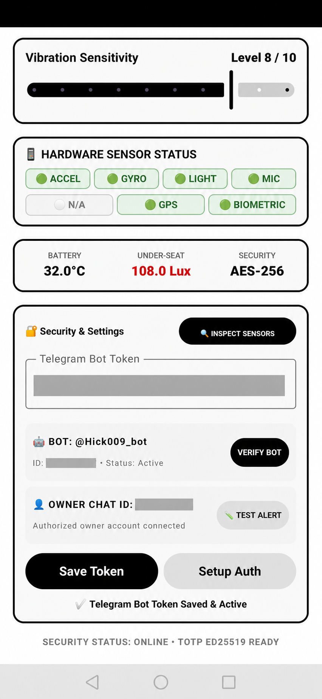
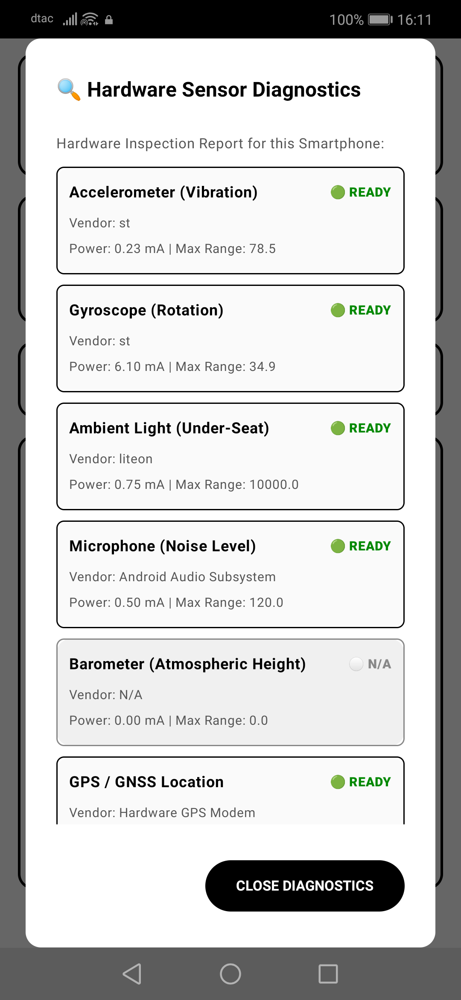

# Motorcycle Guard product-flow audit

Date: 2026-08-08

## Scope

Combined UX, accessibility, and implementation audit of the current Android dashboard, Telegram setup, sensor reporting, alert delivery, remote arm/disarm, and status reporting.

## User goal

An owner should be able to configure one protected motorcycle, see whether protection is genuinely ready, arm or disarm locally or through Telegram, receive useful theft alerts without noise, and verify what happened afterward.

## Captured flow

### Step 1 — Monitoring dashboard: At risk

The main screen clearly exposes armed/disarmed state and live-looking measurements, but repeats the same state in a card and a large circle. The page is too long for the primary task, settings are mixed into monitoring, and labels such as `READY`, `ONLINE`, and `AES-256` overstate what is actually verified.

### Step 2 — Telegram ownership and test alert: Functional but critical security risk

Pairing, bot identity, owner identity, and a test action are visible. However, the full Bot Token is rendered as plain text. The captured raw screenshots containing credentials were deleted; only the redacted audit image is retained. Verification and test delivery also lack reliable in-screen progress, success, and failure states.

### Step 3 — Sensor diagnostics: Partial

The dialog inventories hardware and is readable, but `READY` means only that hardware/provider exists. It does not prove recent samples, permission readiness, calibration, service activity, or whether that sensor currently participates in protection. The large modal requires scrolling and does not prioritize faults.

## Product and implementation findings

### Highest risk

1. Bot Token is visible and must be treated as compromised. Rotate it in BotFather and mask it in the app.
2. The app has no single authoritative protection state. Compose UI, encrypted preferences, the foreground service, sensors, and Telegram callbacks each maintain or infer state separately.
3. Telegram acknowledges `/arm` before confirming that permissions are present and sensors actually started. It can report success when arming was rejected.
4. `/status` reports only stored arm state, sensitivity, and a shortened device ID. It does not report service connectivity, permissions, battery, sensor health, last sample, last alert, delivery state, or degraded mode.
5. Sensors fire independently. There is a per-type 30-second cooldown, but no arming grace period, baseline calibration, event correlation, confidence score, escalation, or recovery state. Light is fixed at 10 lux while the captured dashboard showed approximately 108 lux, so arming in the current environment can alert immediately.

### Functional gaps

1. Vibration sensitivity changes received from Telegram are stored but are not applied to an already-running detector until sensors restart.
2. Audio values are relative amplitude converted to dB, not calibrated sound-pressure level, yet the UI and messages present them as physical dB.
3. GPS is shown as ready when the provider is enabled; no live location fix, age, accuracy, or location is included in status/alerts.
4. Heartbeat code exists but is not connected to the service lifecycle.
5. Test Alert counts queued asynchronous sends, not confirmed Telegram delivery.
6. SMS fallback passes the alert message into a parameter named GPS location and the UI does not show whether fallback is configured or used.
7. Thermal copy claims a power cutoff was initiated, but the app only sends an alert.
8. Safe-mode boot emits a broadcast with no demonstrated alert consumer.
9. The foreground-service notification uses high importance and can become noisy; its text does not distinguish remote-control-only mode from armed sensor monitoring.

### UX and accessibility risks

1. Setup, monitoring, diagnostics, authentication, and emergency controls are combined into one long page.
2. Multiple controls use small text and compact targets; several states rely heavily on green/red color.
3. Technical labels (`AES-256`, device IDs, vendor and range values) compete with the owner's primary decisions.
4. Status changes have no consistent pending, confirmed, failed, or degraded presentation.
5. Sensitive configuration has no reveal/hide affordance and no explicit reset/re-pair path.

## Recommended product model

Use one state machine shared by UI, service, and Telegram:

- `SETUP_REQUIRED`: missing bot ownership, permissions, or required sensors.
- `DISARMED_ONLINE`: remote control connected; theft sensors paused.
- `ARMING`: grace period and baseline calibration in progress.
- `ARMED_HEALTHY`: required sensors sampling and delivery channel reachable.
- `ARMED_DEGRADED`: protection active with a named missing sensor/channel.
- `ALERT_ACTIVE`: correlated incident with severity, evidence, and delivery status.
- `OFFLINE`: service or network heartbeat stale.

Sensor events should enter a fusion pipeline: sample validation, per-sensor baseline, debounce, cross-sensor correlation, severity assignment, cooldown/escalation, durable event history, then Telegram with SMS fallback. Every remote command should return `received`, `applied` or `rejected`, the resulting state, and a reason.

## Evidence limits

- No live theft simulation was run during this audit because it would send external Telegram/SMS alerts.
- TOTP setup was not captured because it contains a secret.
- Screenshot review cannot prove TalkBack semantics, focus order, touch-target size, background survivability, OEM battery restrictions, or actual sensor accuracy.
- Existing automated tests cover policies and helpers but not the real Dashboard, foreground-service lifecycle, Telegram command acknowledgements, or live sensor-to-alert delivery.
