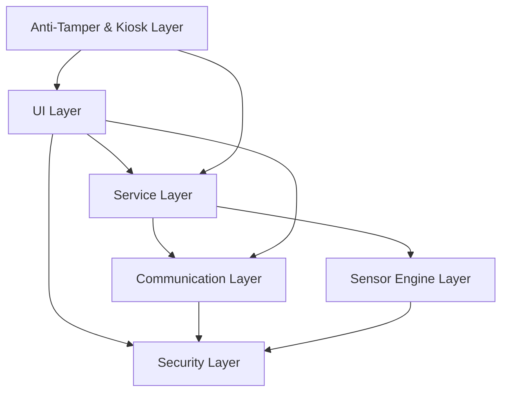
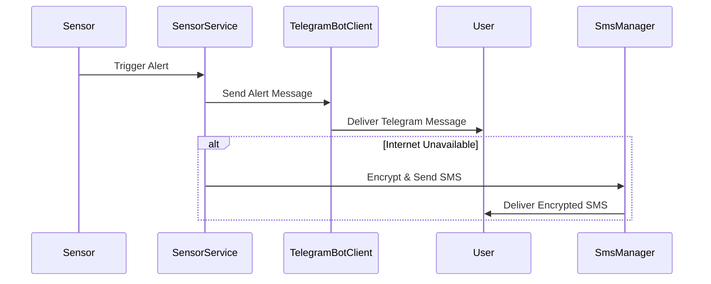
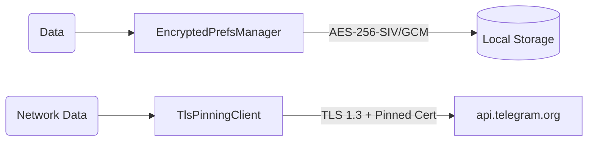
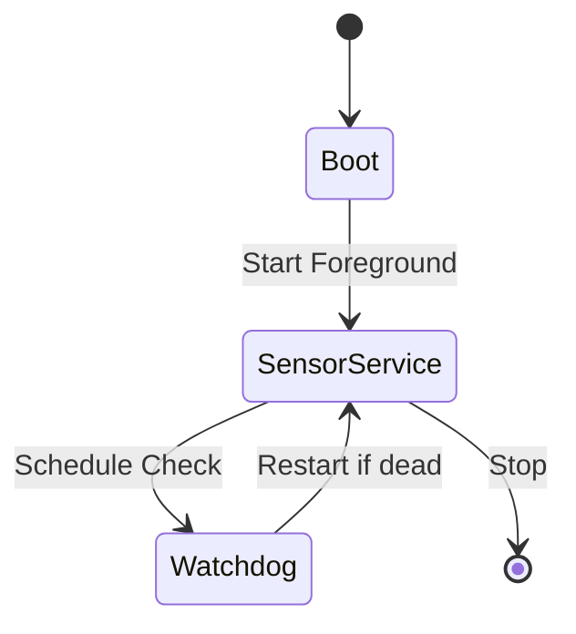

# Motorcycle Anti-Theft Sensor v2.5 Architecture

## Overview
- **Project**: MotorcycleAntiTheftSensor — Android app for motorcycle theft detection and remote alerting
- **Stack**: Kotlin + Jetpack Compose + Android SDK
- **Architecture Pattern**: MVVM-lite / Service-based
- **Package**: `com.example.motorcycleantitheftsensor`

## Layers

### 1. Security Layer (Priority 1 — Foundation)
- `security/SecureKeyManager.kt` — Android Keystore, AES-256-GCM, hardware-backed
- `data/EncryptedPrefsManager.kt` — EncryptedSharedPreferences (AES-256-SIV keys + AES-256-GCM values)
- `network/TlsPinningClient.kt` — OkHttp CertificatePinner for api.telegram.org, TLS 1.3
- `telephony/EncryptedSmsCodec.kt` — AES-128-CBC + Base64 for SMS payloads
- `security/TotpAuthenticator.kt` — RFC 6238 TOTP, HMAC-SHA1, 6 digits, 30s period, rate limiter (3 attempts → 5 min lockout), Google Authenticator QR

### 2. Anti-Tamper & Kiosk Layer (Priority 2)
- `security/AntiTamperKioskManager.kt` — LockTask mode, disable USB debugging, safe mode detection
- `security/ApkIntegrityChecker.kt` — APK signature SHA-256 verification, debugger detection
- `security/DeviceAdminController.kt` — DeviceAdminReceiver, FRP Lock, disable-prevention
- `res/xml/network_security_config.xml` — cleartextTrafficPermitted=false

### 3. Sensor Engine Layer (Priority 3)
- `sensor/VibrationDetector.kt` — Accelerometer, magnitude=sqrt(x²+y²+z²)-g, moving average window=5, dynamic threshold, debounce 3 consecutive
- `sensor/LightIntrusionDetector.kt` — Light sensor, ambient light level monitoring
- `sensor/PowerThermalMonitor.kt` — Battery temperature + voltage monitoring
- `sensor/AudioPeakDetector.kt` — 16 kHz audio threat detection pipeline (YAMNet), adaptive noise floor calibration & signal gating
- `sensor/audio/AudioThreatPipeline.kt` — Monotonically generated audio capture lifecycle with 15s correlation window and candidate buffering

### 4. Service Layer (Priority 4)
- `service/SensorService.kt` — Foreground service, manages all sensor detectors lifecycle
- `service/AlarmWatchdogReceiver.kt` — AlarmManager periodic check, restarts SensorService if killed
- `service/BootCompletedReceiver.kt` — Auto-start SensorService after device boot

### 5. Communication Layer (Priority 5)
- `telegram/TelegramBotClient.kt` — Long polling (timeout=30), chat ID whitelist, commands: /status, /arm, /disarm, /sensitivity, /decode, /help
- `telegram/HeartbeatPinger.kt` — Periodic status heartbeat to Telegram
- `telephony/SmsFallbackManager.kt` — Encrypted SMS fallback when internet unavailable

### 6. UI Layer (Priority 6)
- `ui/DashboardScreen.kt` — Jetpack Compose dashboard with Material 3 dark theme
- `data/DeviceConfig.kt` — Device configuration data class
- `AndroidManifest.xml` — All services, receivers, permissions registered

## Diagrams

### 1. Component Architecture

### 2. Alert Flow

### 3. Security Data Flow

### 4. Service Lifecycle

## Implementation Status
All 22 tasks (SEC-01 through UI-03) are COMPLETE. Build status: SUCCESS.
