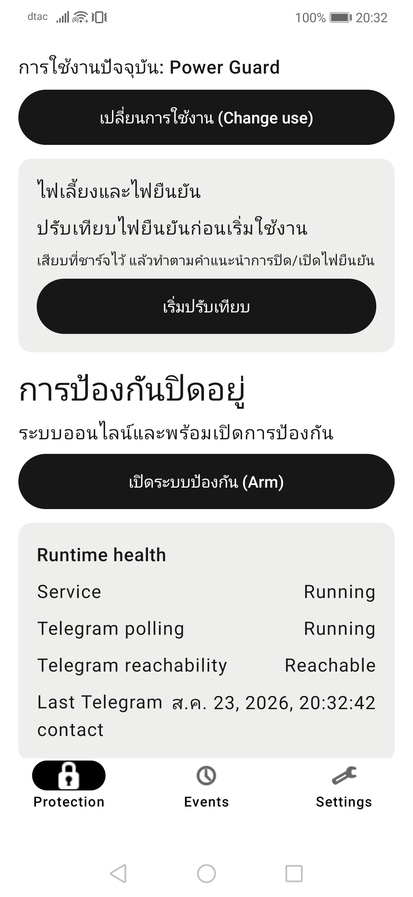
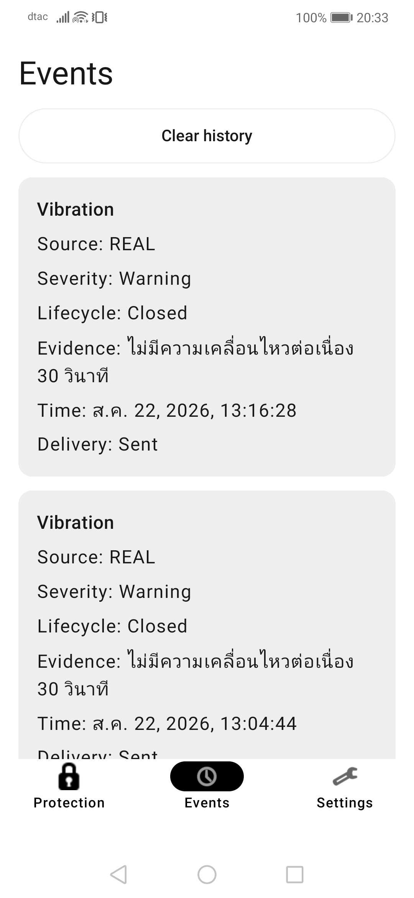
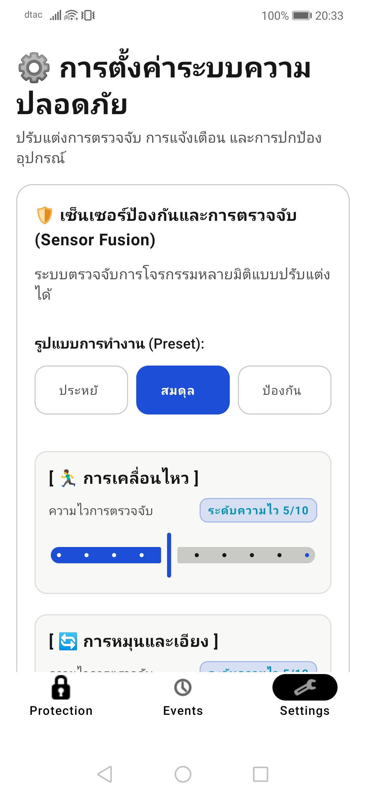

# ตรวจ UX/UI ปัจจุบันเพื่อออกแบบใหม่เป็นภาษาไทย

วันที่ตรวจ: 2026-08-23

## ขอบเขต

- แอป Android ที่ติดตั้งบน Huawei INE-LX2 รุ่นปัจจุบัน ณ เวลาตรวจ
- เส้นทางหลักที่ใช้งานจริง: ป้องกัน, เหตุการณ์, ตั้งค่า
- ตรวจความชัดเจนของภาษา ลำดับข้อมูล หน่วยวัด การรองรับหน้าจอ และความเสี่ยงด้าน accessibility
- ไม่เปิดหน้าจอที่แสดงข้อมูลลับ และไม่บันทึก token, pairing code หรือข้อมูลยืนยันตัวตน

## ขั้นตอนและสุขภาพโดยรวม

1. **ป้องกัน — ต้องปรับปรุงมาก**  
   สถานะหลักและคำสั่งสำคัญปนไทย–อังกฤษ ข้อมูลเทคนิค `Runtime health` เด่นกว่าคำตอบที่ผู้ใช้ต้องการว่า “รถปลอดภัยหรือไม่” และข้อความยาวกินพื้นที่บนจอเล็ก

   

2. **เหตุการณ์ — ต้องออกแบบใหม่**  
   หัวข้อ ปุ่ม และ metadata เกือบทั้งหมดเป็นอังกฤษ การ์ดหนึ่งใบใช้พื้นที่สูงมาก และคำอย่าง `Source`, `Severity`, `Lifecycle`, `Delivery` บังคับให้ผู้ใช้ตีความศัพท์ระบบเอง

   

3. **ตั้งค่า — พื้นฐานดีแต่หนาแน่นเกินไป**  
   สีพื้นสว่างอ่านง่ายขึ้นแล้ว แต่ข้อมูลระดับผู้ใช้ทั่วไปกับ diagnostics ขั้นสูงอยู่ในลำดับเดียวกัน มีไทย–อังกฤษปนกัน และใช้อีโมจิเป็นไอคอนซึ่งแสดงผล/อ่านออกเสียงไม่คงที่ข้ามรุ่น

   

## จุดแข็ง

- โครงหลักมี safe-area padding และแต่ละหน้าหลักเลื่อนได้
- เมนูล่างมีบทบาท tab และสถานะเลือกสำหรับ accessibility
- สีพื้นขาว ตัวอักษรเข้ม และสีสถานะเชิงความหมายเป็นฐานที่นำไปต่อได้
- ปุ่มหลักส่วนมากมีพื้นที่สัมผัสอย่างน้อย 48dp

## ความเสี่ยงสำคัญ

1. ภาษาไทยไม่ครบทั้งข้อความที่เห็นและคำอ่าน TalkBack
2. หน้าป้องกันไม่ตอบสถานะสำคัญด้วยประโยคสั้นก่อนแสดงรายละเอียดระบบ
3. หน้าเหตุการณ์แสดงข้อมูลแบบบันทึกทางเทคนิค แทนการเล่า “เกิดอะไรขึ้น เมื่อไร ส่งแจ้งเตือนแล้วหรือยัง”
4. Settings ไม่มี progressive disclosure ที่ชัดเจน จึงทำให้ตัวเลือกขั้นสูงรบกวนงานประจำ
5. ปุ่มหลายชุดถูกบังคับให้อยู่แถวเดียวและ `maxLines = 1` เสี่ยงตัดคำบนจอ 320–360dp, landscape และ font scale สูง
6. บางปุ่มสูงเพียง 40dp และ slider มุมบางตัวไม่มี range semantics ครบ
7. วันเวลาอิง locale ของเครื่อง จึงไม่รับประกันรูปแบบภาษาไทย
8. หน่วย `°C`, `lux`, `dBFS`, `ms`, `m/s²`, `rad/s`, `µT` ต้องมีรูปแบบและคำอธิบายสำหรับคนทั่วไป ไม่ควรแสดงตัวย่อเดี่ยว ๆ

## แนวทางที่แนะนำก่อนทำภาพแบบ

- คง 3 เมนูหลัก แต่ใช้ “ป้องกัน / เหตุการณ์ / ตั้งค่า” ทั้งภาพและ TalkBack
- หน้าแรกแสดงสรุปเดียวก่อน: สถานะรถ, ความพร้อม, การแจ้งเตือน และปุ่มหลักหนึ่งปุ่ม
- ย้าย runtime/sensor diagnostics ไป “รายละเอียดระบบ” ที่พับเก็บได้
- แบ่ง Settings เป็น “ตั้งค่าพื้นฐาน”, “การแจ้งเตือน”, “ความพร้อมของเครื่อง” และ “ขั้นสูง”
- ใช้ไอคอน vector ชุดเดียวแทนอีโมจิ
- ใช้ layout แบบ adaptive: ปุ่ม stack/wrap ตามความกว้าง, จำกัดความกว้างข้อความบนแท็บเล็ต, รองรับ landscape และ font scale 2.0
- รวมข้อความใน Android string resources และจัดรูปแบบตัวเลข/วันเวลา/หน่วยจากส่วนกลาง

## ข้อจำกัดของหลักฐาน

- ภาพหน้าจอยืนยันได้เฉพาะสิ่งที่มองเห็นใน Huawei เครื่องที่ต่ออยู่ ไม่ใช่การรับรอง accessibility หรือการรองรับมือถือทุกรุ่น
- ยังไม่ได้ทดสอบ TalkBack, font scale 2.0, landscape, จอ 320dp, แท็บเล็ต, dark mode หรือสถานะ error/empty/loading ทุกแบบ
- แบบออกแบบใหม่และ production code ยังไม่เริ่ม จนกว่าจะตกลงโครงข้อมูลและระดับความซับซ้อนเริ่มต้น
