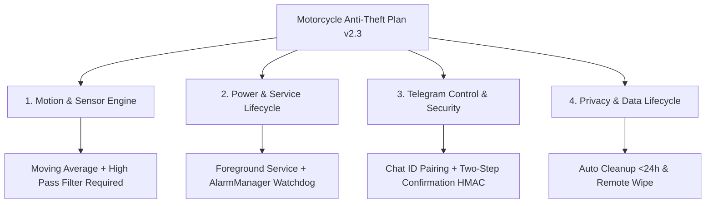

# รายงานการวิเคราะห์และประเมินแผนงานโปรเจค (Godkiller MCP Analysis Report)
**โปรเจค:** ระบบกันขโมยมอเตอร์ไซค์ด้วยมือถือเก่า (Motorcycle Anti-Theft Sensor Project Plan v2.3)  
**พื้นที่โปรเจค:** [`d:\security`](file:///d:/security)  
**โหมดการวิเคราะห์:** Godkiller Ultradeep & Security Verification Framework  

---

## 1. ผลการประเมินภาพรวม (Strategic Assessment & Ambition Level)

จากการวิเคราะห์แผนงาน **`motorcycle-anti-theft-project-plan 3.md`** ผ่าน **Godkiller MCP Tools** (รวมถึง `gk_task`, `gk_scan`, `gk_mode` และ `gk_verify`) พบว่าแผนงานนี้มีความสมบูรณ์สูง มีแนวคิดแก้ปัญหาจริงที่ตอบโจทย์ความเสี่ยงการถอดกล่อง ECU มอเตอร์ไซค์ ด้วยต้นทุนต่ำ แต่มีจุดที่ต้องระมัดระวังเชิงเทคนิคและความปลอดภัย 4 มิติหลัก:



---

## 2. การวิเคราะห์จุดเปราะบางและความเสี่ยง (Blast Radius & Vulnerability Matrix)

| มิติ (Dimension) | ความเสี่ยงที่พบ (Identified Risk) | ผลกระทบ (Impact) | แนวทางแก้ไขเชิงสถาปัตยกรรม (Architecture Mitigation) |
|---|---|---|---|
| **1. Motion Sensing** | แรงสั่นสะเทือนจากเครื่องยนต์จอดวอร์ม, ถนนขรุขระ หรือรถใหญ่ขับผ่าน ทำให้เกิด **False Alarm** | รบกวนผู้ใช้ แจ้งเตือนถี่เกินไปจนผู้ใช้เลิกสนใจ | ใช้ **Linear Acceleration Sensor** + **High-Pass Digital Filter** ตัดแรงโน้มถ่วง และใช้ **Multi-Window Debounce Counter** (ต้องสั่นต่อเนื่อง >3 ครั้งใน 1.5 วินาที) |
| **2. OS Lifecycle** | Android Doze Mode / Battery Optimization ฆ่า `SensorService` เมื่อปิดหน้าจอทิ้งไว้นาน | ระบบหยุดตรวจจับโดยผู้ใช้ไม่รู้ตัว | ใช้ `Foreground Service` (Notification ถาวร) + `START_STICKY` + ตั้งค่า `REQUEST_IGNORE_BATTERY_OPTIMIZATIONS` + `AlarmManager Watchdog Heartbeat` |
| **3. Security** | ปลอมแปลง Telegram Chat ID หรือแอบสั่งการจากบุคคลอื่น | ปลดล็อกระบบกันขโมย (`/disarm`) หรือลบข้อมูล (`/wipe`) | ทำ **Strict Chat ID Whitelisting** + **Two-Step Confirmation** โดยใช้ **6-digit One-Time Nonce** หรือ Confirm Within 30s |
| **4. Hardware / Power** | ตัวแปลงไฟ 12V→5V เกิดความร้อนสูงเมื่อชาร์จมือถือตลอด 24 ชม. หรือสายชาร์จหลุด | มือถือแบตหมด หรือเกิดความร้อนสะสม | ระบบตรวจจับ `ACTION_POWER_DISCONNECTED` แจ้งเตือนสายหลุดทันที + ตรวจวัดอุณหภูมิแบต (`BATTERY_PROPERTY_TEMPERATURE`) แจ้งเตือนเมื่อร้อนเกิน 45°C |

---

## 3. ข้อเสนอแนะการปรับปรุงสถาปัตยกรรมโค้ด (Technical Implementation Recommendations)

### 3.1 อัลกอริทึมตรวจจับการสั่น (Vibration Sensor Filter)
ไม่ควรอ่านค่า Accelerometer ดิบ (`x, y, z`) โดยตรง เพราะค่า $g = 9.81 m/s^2$ ของแรงโน้มถ่วงโลกจะเปลี่ยนไปตามมุมที่วางมือถือ

$$Magnitude = \sqrt{x^2 + y^2 + z^2} - 9.81$$

```kotlin
// แนะนำโครงสร้าง VibrationDetector ใน Android Kotlin
class VibrationDetector(private val threshold: Float, private val debounceMs: Long) {
    private var lastAlertTime = 0L
    private var consecutiveHits = 0

    fun processSample(x: Float, y: Float, z: Float, onTrigger: (Float) -> Unit) {
        val magnitude = sqrt(x * x + y * y + z * z) - SensorManager.GRAVITY_EARTH
        val netAcceleration = abs(magnitude)

        if (netAcceleration > threshold) {
            consecutiveHits++
            if (consecutiveHits >= 3) {
                val now = System.currentTimeMillis()
                if (now - lastAlertTime > debounceMs) {
                    lastAlertTime = now
                    onTrigger(netAcceleration)
                }
            }
        } else {
            if (consecutiveHits > 0) consecutiveHits--
        }
    }
}
```

### 3.2 ความปลอดภัยและการยึดเกราะ Telegram Command
สำหรับคำสั่งวิกฤต เช่น `/disarm`, `/wipe`, `/disable` ต้องใช้ระบบ **Two-Step Confirmation Matrix**:

```
[User]   ───► Send: /disarm
[Sensor] ───► Reply: "⚠️ ยืนยันการปลดล็อก? พิมพ์ /confirm_disarm_8392 ภายใน 30 วินาที"
[User]   ───► Send: /confirm_disarm_8392
[Sensor] ───► Executed: "🔓 ปลดล็อกโหมดกันขโมยเรียบร้อย"
```

---

## 4. แผนการดำเนินการถัดไป (Phased Execution Matrix)

- [x] **Phase 1: Project Setup & Workspace Initialization** (`d:\security`)
- [ ] **Phase 2: Core Sensor Engine Development** ( SensorManager + VibrationDetector + Debounce )
- [ ] **Phase 3: Foreground Service & Power Management** ( Background Execution + Battery Opt Override )
- [ ] **Phase 4: Telegram Bot Integration & Security Pairing** ( Long Polling + Chat ID Auth + Two-Step Confirmation )
- [ ] **Phase 5: Media & Location Features** ( Camera Capture + Audio Recording + GPS Coordinates )
- [ ] **Phase 6: Integration Verification & Field Testing** ( Compile Debug APK + Real Bike Vibration Testing )
