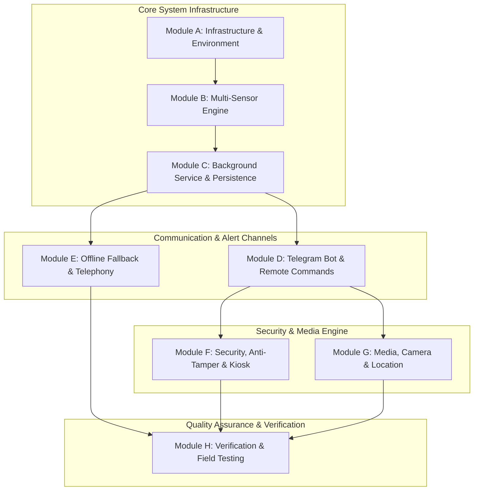

# รายงานการจัดหมวดหมู่และแบ่ง Task ย่อยด้วย Godkiller MCP (Task Breakdown Matrix)

**โปรเจค:** ระบบกันขโมยมอเตอร์ไซค์ด้วยมือถือเก่า (Motorcycle Anti-Theft System)  
**อัปเดต:** 6 สิงหาคม 2026  
**เครื่องมือควบคุม:** Godkiller MCP Task Engine (`gk_task`)  

---

## 1. ผังโครงสร้างโมดูลระบบ (Modular System Architecture)

ระบบถูกแบ่งออกเป็น **8 โมดูลหลัก (Modules A - H)** เพื่อให้สามารถเขียนโค้ด ทดสอบ และตรวจสอบความถูกต้องทีละส่วนได้อย่างเป็นระบบ:



---

## 2. ตารางติตตาม Task ย่อยและ Task ID (Godkiller Task Breakdown Table)

| รหัสโมดูล | ชื่อโมดูล (Module Name) | Task ID (Godkiller) | Task ย่อยในการพัฒนา (Sub-Tasks) | สถานะ (Status) |
|---|---|---|---|---|
| **Module A** | **Project Infrastructure & Environment** | `task_623c3d1d` | **A.1:** ตั้งค่าสคริปต์ `setup_env.ps1` (JDK 21, Android SDK)<br>**A.2:** สร้างโครงร่าง Android Kotlin Project + Gradle Wrapper | 🟢 **COMPLETED** |
| **Module B** | **Multi-Sensor Engine & Detection Logic** | `task_9b09cd6a` | **B.1:** `VibrationDetector.kt` (Moving Average + Debounce)<br>**B.2:** `LightIntrusionDetector.kt` (`Sensor.TYPE_LIGHT`) <br>**B.3:** `PowerThermalMonitor.kt` (45°C Cut-off)<br>**B.4:** `AudioTiltDetector.kt` (Gyroscope + Audio Peak >85dB) | 🟡 **READY FOR DEV** |
| **Module C** | **Background Service & System Persistence** | `task_152ab3d6` | **C.1:** `SensorService.kt` (Foreground Service 24/7 + Notification)<br>**C.2:** `BatteryOptimizationOverride` + Partial WakeLock<br>**C.3:** `AlarmManagerWatchdog` (Heartbeat Listener) | 🟡 **READY FOR DEV** |
| **Module D** | **Telegram Bot & Remote Command Engine** | `task_8ccaa097` | **D.1:** `TelegramBotClient.kt` (Long Polling Engine)<br>**D.2:** Process Commands (`/status`, `/arm`, `/disarm`, `/photo`, `/record`)<br>**D.3:** Silent Heartbeat Ping (ยิง Ping ทุก 15 นาที) | 🟡 **READY FOR DEV** |
| **Module E** | **Offline Fallback & Telephony Alert** | `task_da7e42e6` | **E.1:** `SmsFallbackManager.kt` (ส่ง SMS พิกัดเมื่อไร้เน็ต)<br>**E.2:** `DirectCallAlert.kt` (ยิงสายด่วนดึงความสนใจ) | 🟡 **READY FOR DEV** |
| **Module F** | **Security, Anti-Tamper & Kiosk Lockdown** | `task_59ddd192` | **F.1:** `DeviceConfig.kt` (Device UUID + Telegram Chat Whitelist)<br>**F.2:** Two-Step Confirmation (OTP 6 หลัก 30s Timeout)<br>**F.3:** Kiosk Lock Task Mode (ปิด Power Off Menu / Settings Bar)<br>**F.4:** Privacy Auto-Delete Engine (ลบไฟล์ใน 24 ชม. & `/wipe`) | 🟡 **READY FOR DEV** |
| **Module G** | **Media, Camera & Location Services** | `task_dcb37d87` | **G.1:** `CameraCaptureManager.kt` (CameraX Snapshot)<br>**G.2:** `AudioRecordManager.kt` (MediaRecorder Audio)<br>**G.3:** `LocationProvider.kt` (GPS + Cell Tower LBS Backup) | 🟡 **READY FOR DEV** |
| **Module H** | **Verification, Build & Field Testing** | `task_c93588fd` | **H.1:** Gradle APK Assembly (`assembleDebug`)<br>**H.2:** Static Security Scan (`gk_scan.security`)<br>**H.3:** Real Motorcycle Vibration & False Alarm Testing | 🟡 **READY FOR TEST** |

---

## 3. ขั้นตอนและคำสั่งในการตรวจสอบแต่ละ Task (Task Verification Rubric)

สำหรับการตรวจสอบความถูกต้องตามหลัง (Retrospective & Step-by-Step Verification) สามารถใช้คำสั่ง Godkiller MCP ดังนี้:

### 3.1 การตรวจสอบภาพรวม Phase และ Rubric
```bash
# ตรวจสอบสถานะและเงื่อนไขความสำเร็จของโมดูล B
gk_phase action="rubric" kwargs={"task_id": "task_9b09cd6a"}
```

### 3.2 การตรวจสอบ Static Security & AST Code Analysis
```bash
# สแกนความปลอดภัยซอร์สโค้ดในโมดูล
gk_scan action="security" args={"target": "d:\\security\\MotorcycleAntiTheftSensor"}
```

### 3.3 การทดสอบ Build & Unit Verification
```bash
# ทดสอบคอมไพล์ APK
powershell -ExecutionPolicy Bypass -Command "& d:\security\scripts\setup_env.ps1; Set-Location d:\security\MotorcycleAntiTheftSensor; .\gradlew.bat assembleDebug"
```
