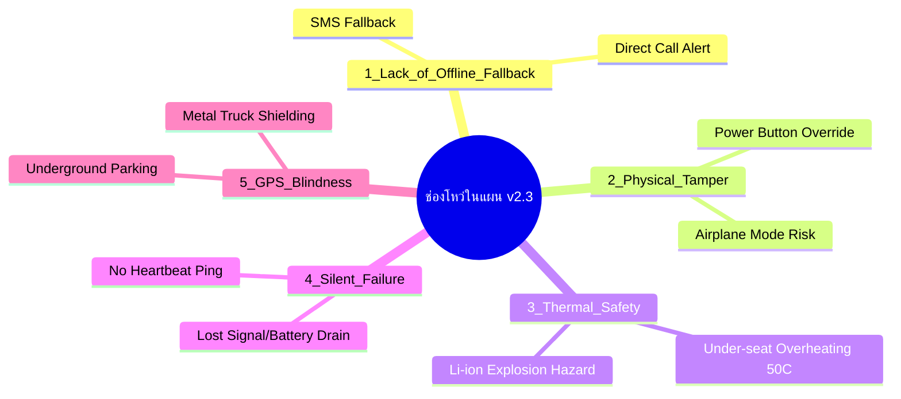

# รายงานการวิเคราะห์ช่องโหว่ของแผนงาน & แนวทางพัฒนาแอปจาก GitHub (Loopholes & Open-Source Research)

**โปรเจค:** ระบบกันขโมยมอเตอร์ไซค์ด้วยมือถือเก่า (Motorcycle Anti-Theft Sensor Project)  
**อัปเดต:** 6 สิงหาคม 2026  

---

## 1. การวิเคราะห์ช่องโหว่เชิงลึกที่ยังตกหล่นในแผน (Deep Loopholes Analysis)

จากการวิเคราะห์แผนพัฒนาฉบับ v2.3 ร่วมกับภัยคุกคามจริงในประเทศไทย (พฤติกรรมคนร้ายลักลอบถอดกล่อง ECU และยกรถ) พบช่องโหว่สำคัญ 5 ประการดังนี้:



### 🔴 ช่องโหว่ที่ 1: การขาดระบบแจ้งเตือนสำรองแบบไร้อินเทอร์เน็ต (Lack of Offline Fallback)
* **ปัญหา:** หากคนร้ายใช้เครื่องตัดสัญญาณ Cell-Jammer หรือรถถูกยกเข้าลานจอดรถใต้ดิน 3 ชั้น สัญญาณ 4G/5G จะหลุด ทำให้ Telegram / LINE ส่งไม่ผ่าน
* **แนวทางแก้ไข:** 
  - เพิ่ม **SMS Fallback System:** ส่ง SMS พิกัดและข้อความเตือนเมื่อส่งอินเทอร์เน็ตไม่สำเร็จภายใน 10 วินาที
  - เพิ่ม **Direct Call Alert (Missed Call):** ให้มือถือเก่าโทรออกไปยังเบอร์มือถือหลักทันที ซึ่งโทรศัพท์สายหลุดจะส่งเสียงดังก้องมือถือหลักได้ชัดเจนกว่าข้อความไลน์

### 🔴 ช่องโหว่ที่ 2: ความเสี่ยงด้านความร้อนและความปลอดภัยของแบตเตอรี่ (Thermal Runaway Hazard)
* **ปัญหา:** พื้นที่ใต้เบาะมอเตอร์ไซค์ในเมืองไทยมีความร้อนสูงถึง 50°C-60°C การเสียบชาร์จมือถือทิ้งไว้ตลอด 24 ชั่วโมงทำให้เกิดเสี่ยงแบตบวม หรือเกิดเพลิงไหม้ (Thermal Runaway)
* **แนวทางแก้ไข:**
  - **Battery Temperature Guard:** อ่านค่าอุณหภูมิแบตผ่าน `BatteryManager.EXTRA_TEMPERATURE` หากสูงเกิน 45°C ให้สั่งหยุดชาร์จไฟหรือส่งเตือน
  - **Battery Elimination Mod (แนะนำสำหรับช่าง):** ถอดแบตเตอรี่ลิเธียมออกจากตัวเครื่อง แล้วต่อสายแปลงไฟ DC 5V 2A ตรงเข้าขั้วบอร์ดมือถือโดยตรงเพื่อความปลอดภัยถาวร

### 🔴 ช่องโหว่ที่ 3: ความเสี่ยง Silent Failure (การขาด Heartbeat Monitor)
* **ปัญหา:** หากเน็ตหมด ซิมถูกตัด หรือแอปค้าง มือถือหลักจะไม่รู้เลยว่า Sensor ดับไปแล้ว (หลงคิดว่ารถปลอดภัยทั้งที่ระบบล่ม)
* **แนวทางแก้ไข:**
  - เพิ่ม **Heartbeat Ping ทุก 15-30 นาที:** มือถือในรถจะยิง Silent Ping หา Telegram Bot
  - หากเกิน 30 นาที Bot Server ไม่ได้รับ Ping จะส่งข้อความเตือนไปยังมือถือหลักว่า *"⚠️ ขาดการติดต่อกับรถเกิน 30 นาที กรุณาตรวจสอบ"*

### 🔴 ช่องโหว่ที่ 4: การขโมยเครื่อง Sensor / การกดปิดเครื่อง (Physical Tampering)
* **ปัญหา:** หากคนร้ายเจอตัวมือถือ อาจกดปุ่ม Power ปิดเครื่อง หรือสไลด์แถบตั้งค่าเพื่อเปิด Airplane Mode
* **แนวทางแก้ไข:**
  - เปิด **Kiosk Mode / Lock Task Mode:** ล็อกหน้าจอแอปไม่ให้สลับแอป หรือเปิด Quick Settings Bar
  - **Instant Photo & GPS Upload:** เมื่อตรวจจับแรงสั่นได้ ให้ถ่ายภาพและอัปโหลดพิกัดทันทีใน 1-2 วินาทีแรก ก่อนที่คนร้ายจะมีเวลาปิดเครื่อง

### 🔴 ช่องโหว่ที่ 5: การอับสัญญาณ GPS (GPS Blindness in Covered Area)
* **ปัญหา:** เมื่อรถถูกยกขึ้นรถตู้ทึบหรือลานจอดใต้ดิน สัญญาณ GPS จากดาวเทียมจะดับ
* **แนวทางแก้ไข:**
  - ใช้ **Cell Tower Triangulation (LBS)** + **Wi-Fi BSSID Scanning:** ระบุพิกัดคร่าวๆ จากเสาสัญญาณมือถือและ Wi-Fi รอบข้างแม้ไม่มีสัญญาณ GPS

---

## 2. การสังเคราะห์แนวทางพัฒนาแอปจาก GitHub & Open-Source

จากการสำรวจ Open-Source Repositories บน GitHub ที่เกี่ยวข้องกับ Android Anti-Theft & IoT Security (เช่น `xdmtk/sim808-anti-theft`, `adnanamin69/Theif_detector`, `abhisenberg/PocketSafe`, `namviet157/GPS_Tracking`):

### 💡 แนวทางที่ 1: Multi-Sensor Fusion Engine (การรวมพลัง 4 เซ็นเซอร์)
ถอดแบบจากแอปพลิเคชันยอดนิยมใน GitHub โดยไม่ใช้แค่ Accelerometer อย่างเดียว:

```
[ Sensor Fusion Hub ]
  ├── 1. Accelerometer + Gyro (ตรวจจับการสั่นและการเอียงตัวรถ Tilt Angle > 15°)
  ├── 2. Light Sensor (ตรวจแสงใต้เบาะ - ถ้าคนร้ายเปิดกล่อง ECU/เปิดเบาะ ไฟจะเข้า แจ้งเตือนทันที!)
  ├── 3. Power Disconnect (ตรวจจับการตัดสายไฟ/สายชาร์จ)
  └── 4. Proximity / Audio Peak (ตรวจจับระดับเสียงเคาะ/ตัดเหล็ก > 85 dB)
```

### 💡 แนวทางที่ 2: Kiosk Mode & Anti-Tamper Lockdown (แนวทางจาก PhoneGuard & PocketSafe)
- ใช้ `DevicePolicyManager` ตั้งค่าแอปให้เป็น **Device Owner**
- ปิดปุ่ม Power Off Menu (ไม่ให้กด shutdown ได้ถ้าไม่ใส่ PIN)
- ซ่อนแอปไม่ให้เห็นไอคอนบนหน้าจอ (Run in Stealth Mode)

### 💡 แนวทางที่ 3: Bluetooth BLE Keyfob & Proximity Arming (แนวทางจาก Ctrl-MC & ESP32 Projects)
- นำ ESP32 เล็กๆ หรือ พวงกุญแจ BLE Beacons มาผูกกับมือถือ
- เมื่อเจ้าของเดินห่างจากรถเกิน 10 เมตร (สัญญาณ BLE หลุด) -> แอปเข้าโหมด **Auto-Arm** อัตโนมัติ
- เมื่อเจ้าของเดินกลับมาใกล้รถ (สัญญาณ BLE ติด) -> แอป **Auto-Disarm** อัตโนมัติโดยไม่ต้องพิมพ์คำสั่ง

---

## 3. ตารางสรุปการอัปเกรดแผนงาน (Actionable Upgrade Matrix)

| ฟีเจอร์ที่เพิ่มเข้ามา | แหล่งอ้างอิงแนวคิด | ลำดับความสำคัญ | การ 구현 ใน Android Kotlin |
|---|---|---|---|
| **1. Light Intrusion Sensor** | GitHub `Thief_detector` | 🔴 สูงมาก (High) | ใช้ `Sensor.TYPE_LIGHT` เมื่อค่า Lux > 10 (เปิดเบาะ) ให้เตือนทันที |
| **2. Offline SMS / Call Alert** | GitHub `sim808-anti-theft` | 🔴 สูงมาก (High) | ใช้ `SmsManager` + `Intent.ACTION_CALL` เมื่อไร้เน็ต |
| **3. Battery Temp Safety Guard** | Best Practice Hardware | 🟡 ปานกลาง (Medium) | อ่าน `BatteryManager.EXTRA_TEMPERATURE` ตัดไฟเมื่อ > 45°C |
| **4. Heartbeat Ping Monitor** | System Reliability Standard | 🔴 สูงมาก (High) | ใช้ `WorkManager` หรือ `AlarmManager` ส่ง Ping ทุก 15 นาที |
| **5. BLE Proximity Auto-Arm** | GitHub `Ctrl-MC` | 🟢 ทางเลือกเสริม | ใช้ `BluetoothLeScanner` ตรวจจับ Beacon ห่าง/เข้าใกล้ |
